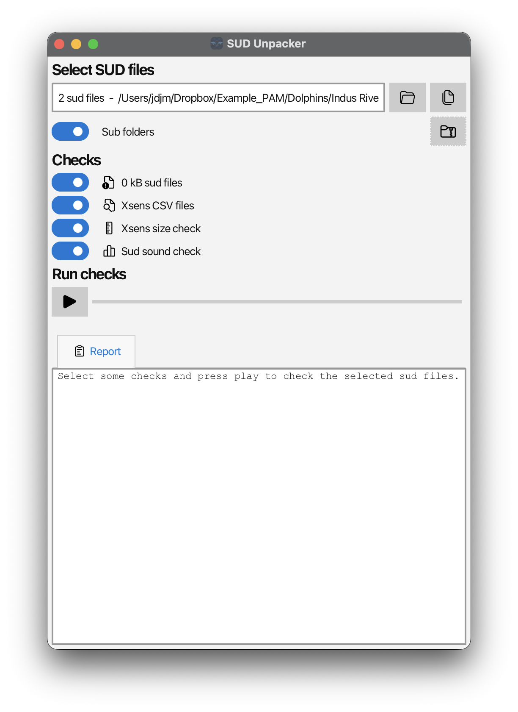
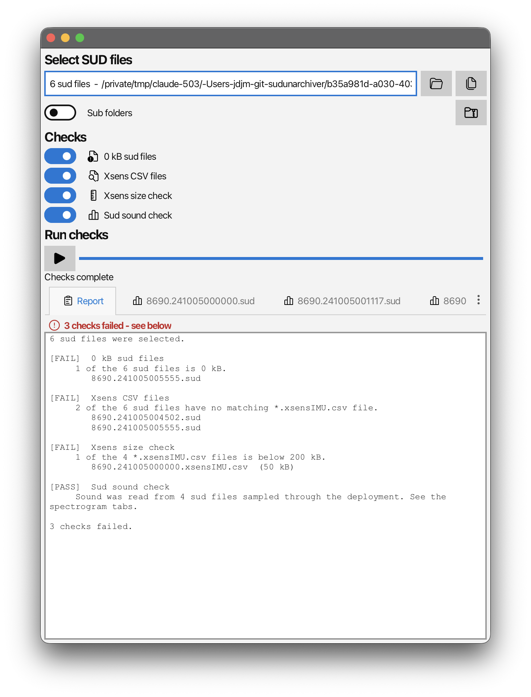
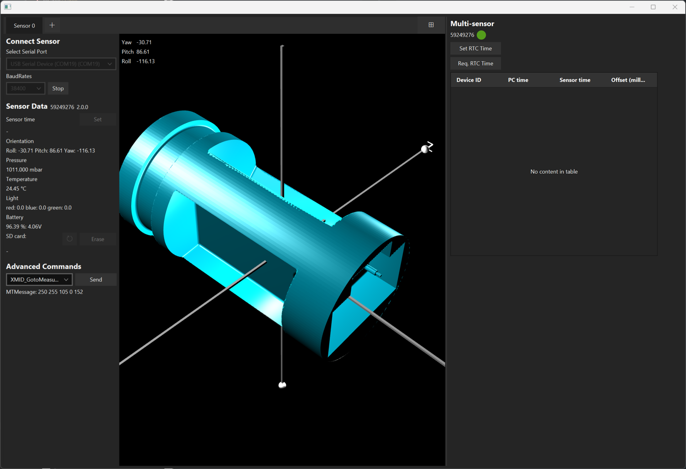

## Introduction

Data validation is an important part of fieldwork. There are a number of things that can go wrong with SoundNet devices -- a sensor package may not record or may be damaged, a hydrophone may fail, or a download may not complete. Identifying these issues as soon as they happen, whilst the boat, the spares and the crew are still there, means that fieldwork time is not wasted.

The checks on this page should be run after every recovery, once data have been downloaded from the SoundTrap. They take a few minutes per deployment.

## Software

Both programs used on this page are available from the [home page](../index.qmd) or the [downloads page](downloads.qmd):

- **SUDUnarchiver** -- extracts data from `.sud` files and runs the validation checks.
- **xsensViewer** -- connects to a sensor package to check whether it is working.

SUDUnarchiver is a utility program developed to make decompressing `.sud` files much easier and, crucially, to let users extract parts of a `.sud` file without decompressing the sound data, which often requires terabytes of hard disk space.

## Checking the sud files

### Extracting the sensor and metadata files

Once data have been downloaded using the SoundTrap host software, the `.sud` files need to be checked. The first stage is to extract the sensor and metadata files.

1.  Open SUDUnarchiver and select the deployment folder using the folder button. Turn on **Sub folders** if the `.sud` files sit in nested folders.
2.  Turn on every toggle in the **Decompress** section [*except*]{.underline} **Wav files** -- there is no need to decompress the audio unless you specifically want raw wav files for analysis in another program.
3.  Leave **Save to** empty so that the extracted files are written alongside the `.sud` files.
4.  Press the play button and let the program work through the deployment.

{#fig-decompress width=400 fig-align="center"}

### Running the validation checks

Once the files are extracted the next stage is to validate the data. Press the **Verify** button (the clipboard icon) to flip the window round to the **Checks** controls, select all four checks and press the play button again.

{#fig-checks width=400 fig-align="center"}

The four checks are:

| Check | What it looks for |
|--------------------|----------------------------------------------------|
| **0 kB sud files** | `.sud` files which are empty, usually because a download did not complete. |
| **Xsens CSV files** | Every `.sud` file has a matching `*.xsensIMU.csv` file. |
| **Xsens size check** | Every `*.xsensIMU.csv` file is above 200 kB. |
| **Sud sound check** | Opens four `.sud` files spread through the deployment and plots a 20 second spectrogram from each. |

: The checks SUDUnarchiver runs on a folder of sud files.

The sound check opens and decompresses audio, so it is far slower than the other three. A long deployment can take several minutes.

SUDUnarchiver returns a result for each check in the **Report** tab. Ideally everything is green. If it is not, the report lists the files which failed, and the sections below explain what each failure means.

{#fig-report width=475 fig-align="center"}

## Interpreting the results

### If 0 kB sud files are present

Go back to SoundTrap host with the SoundTrap attached and look at the file list. Do any of the files say *partial* instead of *downloaded*? Or do any of the files show as simply not downloaded? If so, these files need to be downloaded again.

### If there are fewer xsensIMU.csv files than sud files

This usually means the sensor package has failed at some point or run out of battery. The sensor packages should have firmware 2.0.7 installed -- see [Checking the sensor packages](#checking-the-sensor-packages) below. Get in touch if this happens.

::: callout-note
SUDUnarchiver looks for the `*.xsensIMU.csv` file next to the `.sud` file and in the save folder. If the extracted files were moved somewhere else, this check will fail even though the data are fine.
:::

### If some xsensIMU.csv files are under 200 kB

This indicates the sensor package is working and sending data but the IMU has failed. This is a serious error. However, it can also happen simply because the `.sud` files are short, for example as the SoundTrap battery gets low. Open one of the small `.xsensIMU.csv` files and check it contains angle (`EL`) data. If it does not, the sensor package is faulty -- see [Checking the sensor packages](#checking-the-sensor-packages) below.

### If the spectrograms look wrong

The sound check plots a spectrogram for each channel of the four sampled files, each in its own tab. Check for anything odd -- one channel much noisier or much quieter than the others indicates a hydrophone may be damaged. Replace it if you have spares, or get in touch.

{#fig-spectrogram width=475 fig-align="center"}

## Checking the sensor packages {#checking-the-sensor-packages}

If a sensor package did not work, or you suspect it might be damaged, the easiest way to check is with xsensViewer.

Connect the sensor package to your computer, select the correct serial port from the dropdown menu and press **Connect**. The baud rate should be 38400. After a few seconds the sensor package should start streaming data and appear as a 3D sensor which moves in real time as you rotate it. Also check that depth and temperature look sensible, that the battery is near 100% and that the firmware version next to the *SensorData* title is 2.0.7.

If nothing happens after a few seconds, reset the sensor package using the button on the cable, close the program and try again.

{#fig-xsensviewer}

See the [field protocols](field-protocols.qmd) page for more detail on the sensor packages and how they are set up.

## Summary

- Download the data with SoundTrap host and check nothing is listed as *partial*.
- Extract everything except the wav files with SUDUnarchiver.
- Run all four checks and read the report.
- Empty `.sud` files -- download them again.
- Missing or undersized `.xsensIMU.csv` files -- check the sensor package in xsensViewer.
- Odd looking spectrograms -- check the hydrophones.
