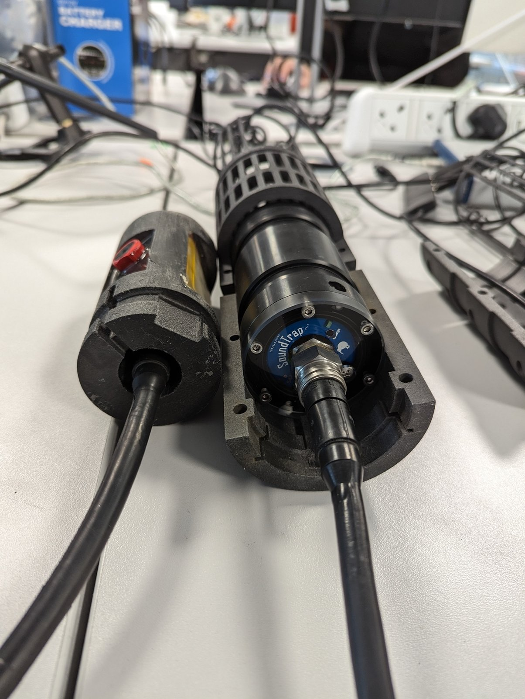
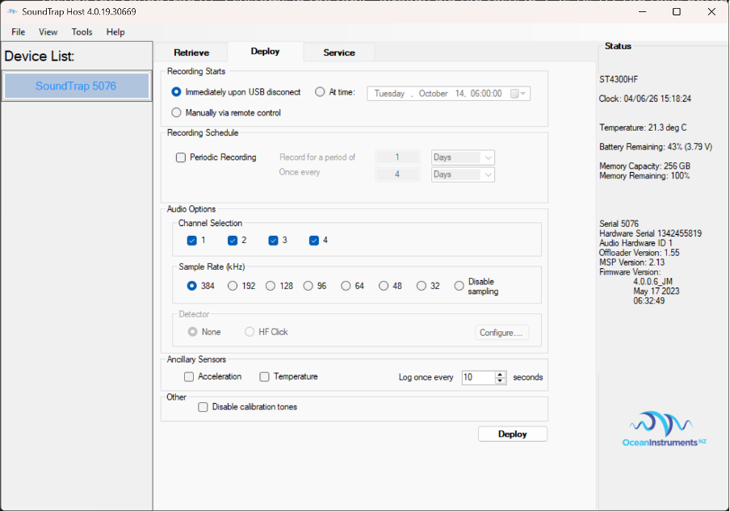
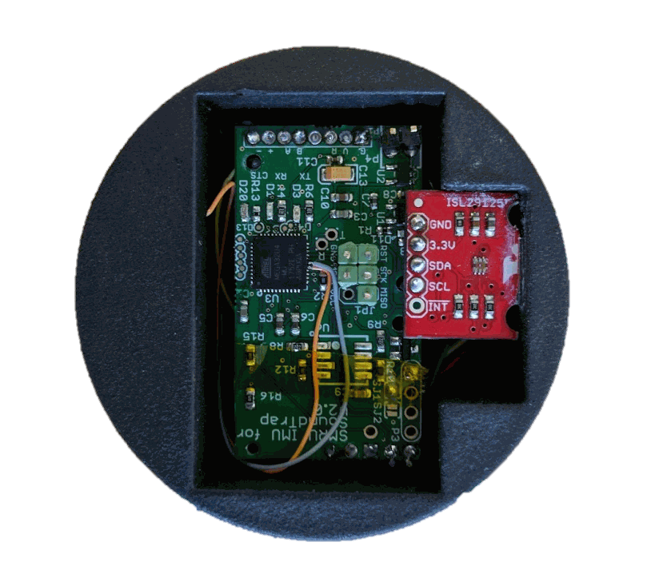
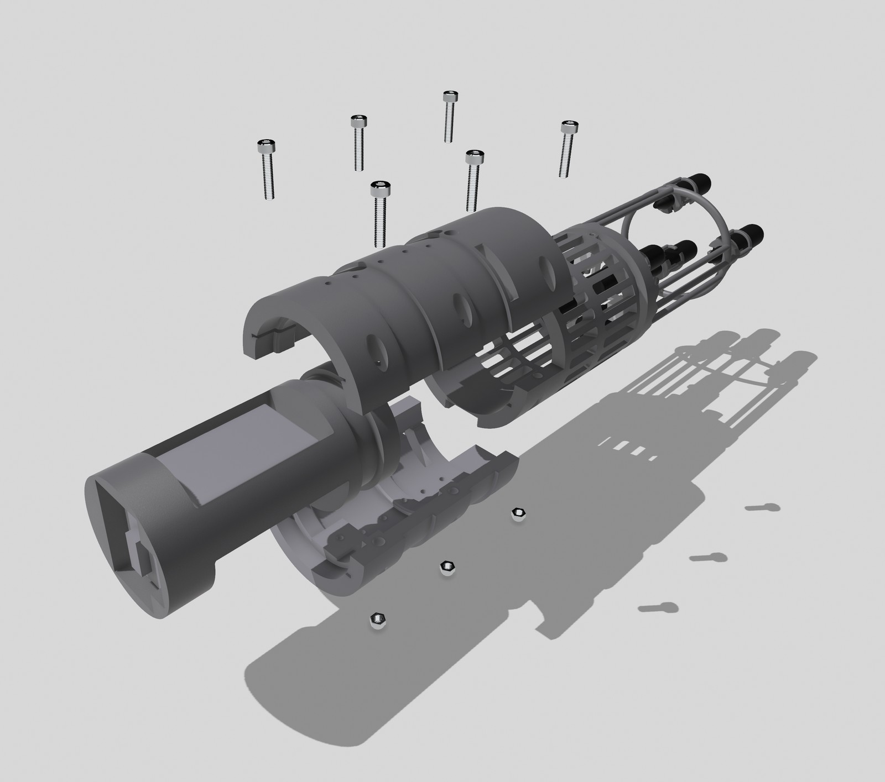
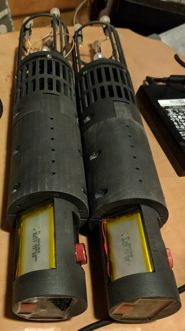

## Hardware overview

SoundNet consists of multiple 4 channel PAM devices that record sound, depth and
orientation. Each PAM device contains a micro aperture hydrophone array, a 4 channel
SoundTrap and sensor package held together by a 3D printed frame. The SoundTrap records
audio from the hydrophones and data from the sensor package, time syncing the orientation
data with acoustic sample time to allow for ultra-accurate orientation measurements. The
combination of audio and orientation data allows each PAM device to determine a 3D bearing
to a sound source. If multiple devices are deployed together at known locations, they can
triangulate the exact location of a source.

{#fig-system-overview}

## Software

SoundTrap software is available from
[oceaninstruments.co.nz](http://www.oceaninstruments.co.nz/).

xsensViewer is available from
[GitHub](https://github.com/Sound-Net/xsensViewer/releases/tag/xsens_viewer), or from the
[downloads page](downloads.qmd) on this site.

## Initial setup

You need a special firmware version for the 4 channel SoundTraps. You will need to point
the software to a `.bin` file. Once you have done this the software remembers the file, so
as long as it does not move and you use the same computer for SoundTrap setup, this
process should not need to be repeated.

First, click on **View → Service**. In the service menu, whilst holding <kbd>Shift</kbd>,
press **Update Application Firmware**. This will bring up a file browser. Use the file
browser to point to the `.bin` file. Click **OK**. The firmware version should have a build
date of **7 May 2023** or later.

{#fig-service-firmware}

## Setting up the 4 channel SoundTrap

### Connecting hardware

Both the SoundTrap and the sensor packages are connected to a computer via two SubConn
cables. The SoundTrap SubConn cable has a male end and the sensor package SubConn has a
female end. The sensor package SubConn cable has a small button which can be used to force
the sensor package to reset. Note that the cable does not need to be connected to a PC to
reset the sensor package.

{#fig-subconn}

### Starting the SoundTrap

Open SoundTrap host to set up the SoundTrap. Double click on the SoundTrap serial number on
the left to bring up the SoundTrap settings. The first thing to do is to set the clock. Go
to **View → Service** and then in the service tab select **Update Sudar Clock**.

{#fig-deploy-tab}

### Setting up the SoundTrap in the Deploy tab

1.  **Recording Starts** -- *At time*, set an hour or so before the net will be deployed.
    Or use *Immediately upon USB disconnect* to start recording straight away.
2.  Check all four channels are ticked.
3.  **Sample Rate**: 384 kHz.
4.  **Acceleration** and **Temperature** boxes should be empty.
5.  Check battery is full (at least 95%) and memory is empty.
6.  Check the clock is synced with the PC. Select **View → Service → Sync Sudar Clock**.
7.  Check that the firmware is correct. The firmware version should be `4.0.0.6_JM` and the
    date should be 17 May 2023 or later.
8.  Click **Deploy** to save settings to the SoundTrap. A box will appear saying firmware
    may be out of date. This is fine.

### Setting up the sensor package

The sensor package should be left charging and the reset button on the cable pressed after
each deployment. Whilst charging the red LED will be lit and the orange LED should blink
every 4 seconds (every 8 seconds if the battery is very low) to indicate the sensor package
is in standby mode.

When ready for a new deployment, check that everything in the sensor package is working
using xsensViewer. Open xsensViewer to bring up the program as shown in
@fig-xsensviewer. Select the correct COM port -- you can go to device manager to check if
you have multiple COM ports. The baud rate should be 38400. Click **Connect** and after a
few seconds the sensor package should start streaming data to the program. If it does not
work, reset the device, close the program and try again.

The 3D view of the sensor package will move in real time. Rotating the sensor will show
that everything is working. Also check depth and temperature measurements are sensible and
the battery level is near 100%. If everything looks good, disconnect the sensor -- it will
automatically switch to deploy mode ready for connection to a SoundTrap.

Notes:

-   If the program does not start after a few seconds, close it, reset the sensor package,
    open the program and try again.
-   Temperature is often 5--10 degrees higher than it should be. This is because it is
    designed to measure water temperature, not air temperature.
-   Simply pressing the reset button on the cable will also set the sensor package into
    deploy mode.
-   Check the firmware version is correct (currently 2.0.6, located next to the
    *SensorData* title).

{#fig-xsensviewer}

{#fig-sensor-board}

Labelled on the board in @fig-sensor-board:

-   **Orange LED** -- shows the device is in standby mode.
-   **Green LED** -- shows that the device is communicating with the SoundTrap.
-   **Green LED** -- ignore this one. It is often removed.
-   **Light sensor** -- must remain unobstructed.

The orange LED will flash every 5 seconds when in standby mode, indicating the sensor
package is ready to connect to a SoundTrap. If it flashes every 8 seconds, the device has a
dead battery and will need to be charged for 24 hours. You can connect to a SoundTrap after
it has started recording, or before if a delay timer has been set. You cannot use the
SoundTrap remote and sensor package together.

Once connected, after a few minutes both the orange and green LED on the sensor package
will switch on if the SoundTrap has been set to start immediately. If the SoundTrap has a
delayed start then the sensor package will only switch on when the SoundTrap starts.

::: {.callout-note}
There are specific sensor packages for specific SoundTraps. This is because the rotation of
the rear connector is not consistent between different SoundTraps. Coloured tape on the
SoundTraps and sensor packages indicates which devices go with which.
:::

| Orange | Green | Status |
|:-------------|:-------------|:--------------------------------------|
| Flashing (~every 5 seconds) | -- | Standby mode. Awaiting connection to a SoundTrap. |
| Flashing faintly (~every 8 seconds) | -- | Low battery mode. Needs charged and will not connect to PC. |
| Flashing (~every 5 seconds) | Flashing constantly | Reading sensors. |
| Constant | Constant | Gyroscope calibration is being performed. Do not move the SoundTrap. Movement will result in gyroscope calibration being discarded and default values used (not the end of the world). |
| -- | Flashing brightly every second | The sensor package has just been reset and is booting up. |

: Description of LED settings. {#tbl-led}

### Putting the SoundTrap and sensor package together

The inner housing is simple to put together.

::: {.callout-warning}
Make sure there is **silicon grease** on the female SubConn at the back of the SoundTrap
before connecting the sensor package.
:::

Use stainless steel bolts to clamp the two 3D printed sections together as shown in
@fig-inner-housing. Take care that you do not put much pressure on the hydrophone cables --
these are delicate.

{#fig-inner-housing}

{#fig-assembled}

### HDPE outer housing

Slide the device into the HDPE tube. It can be tight to get the SoundTraps in and you can
use a rod or similar to gently push the device.

::: {.callout-warning}
Do **not** put any pressure on the hydrophone frame as this can break easily.
:::

Once the device is in the sleeve, secure it with a single bolt through the side of the
sleeve. Use electrical tape or similar to ensure the bolt does not fall out.

## Deployment

The SoundTraps can be deployed in up to 80--100 m of water. Once the SoundTraps have been
deployed it is important to locate exactly where they are on the seabed. This can be
achieved by generating sounds at known locations which are then used to locate the position
of the device. The easiest way to generate sounds is to drive a vessel in a rough 50--300 m
radius around the approximate location of the SoundTrap. The SoundTrap will record the
broadband transients generated by propellor cavitation, which can be used to localise the
position of the boat.

::: {.callout-important}
It is vital that a GPS is used to record the position of the boat during these manoeuvres,
and that the GPS is synced to the SoundTrap clocks or the offset is known.
:::

For example, tapping the SoundTraps and recording the exact GPS time can help synchronise
clocks. Ideally the same manoeuvres can be performed when the devices are recovered to
check if they have moved. Note that the LEDs switch off in water; they will restart when
the device is lifted out of the water.

## Recovery

### Stopping the SoundTrap and saving data

The SoundTrap is stopped by removing the outer housing, disconnecting the sensor package
and saving the data, just like the single channel SoundTraps.

The sensor package should be put on charge as soon as possible by connecting to a USB port.
Press the reset cable (black and white, against the outer metal of the USB cable) to reset
the device so that the orange flashing LED comes on.

### Downloading data

Download data using the SoundTrap host software in exactly the same way as you would a
normal SoundTrap. Once the sud files are decompressed, each wav file should have an
associated sensor package `.csv` file, for example
`1678032921.230406155726.xsensIMU.csv`. This contains all the information recorded on the
sensor package in a csv format.

The comma delimited csv format is:

``` {.wrap}
Unix time, microseconds since last second, sample number of audio, flag (see below), data...
```

| Sensor flag | No. data points | Units | Description |
|:-------|:---------|:----------------|:-------------------------------------------|
| `EL` | 3 | Degrees | Euler angles (roll, pitch, heading) (floating point) |
| `QT` | 4 | Vector | Quaternion (4 element vector) (floating point) |
| `RTC` | 2 | Seconds, microseconds | Real time clock unix time (integer), microseconds since unix second (integer) |
| `RGB` | 3 | Relative | Light sensor (red, green, blue -- relative) (floating point) |
| `LSP` | 10 | Relative | Light sensor full spectrum: 415 nm, 445 nm, 480 nm, 515 nm, 555 nm, 590 nm, 630 nm, 680 nm, Clear, NIR |
| `PT` | 2 | Millibar, Celsius | Depth and temperature |
| `BAT` | 2 | Voltage, percentage remaining | Battery data |
| `TM` | 1 | Celsius | Rapid response temperature sensor for sound speed profiling |

: A description of the different parameters in the sensor package CSV. {#tbl-csv}

## Summary

### Start

-   Check the sensor package is working in xsensViewer.
-   Reset the sensor package and ensure it is flashing orange (standby mode).
-   Start the SoundTrap, either recording immediately or starting at a specified time.
-   Connect the sensor package and SoundTrap.
-   Put together the inner housing. Make sure the sensor package does not wobble.
-   Insert the SoundTrap into the outer HDPE housing.

### Deployment

-   Tap the SoundTraps and record GPS time.
-   Deploy the SoundTraps 30--40 metres apart.
-   Record positions using a handheld GPS and drive in a 50--300 m diameter circle around
    where the SoundTraps are thought to lie on the seabed.

### Recovery

-   Record positions using a handheld GPS and drive in a 50--300 m diameter circle around
    where the SoundTraps are thought to lie on the seabed.
-   Recover the SoundTraps.
-   Tap the SoundTraps and record GPS time.
-   In a dry area (can be hours later in the office) remove the outer and inner housing.
-   Rinse everything in fresh water.
-   Disconnect the sensor package, connect to cable, press reset and leave to charge.
-   Connect the SoundTrap to a computer and download data using SoundTrap host.
-   Quickly check everything has run by downloading the last file -- if the sensor data is
    there and the sound files look good, it has probably been a successful deployment.
