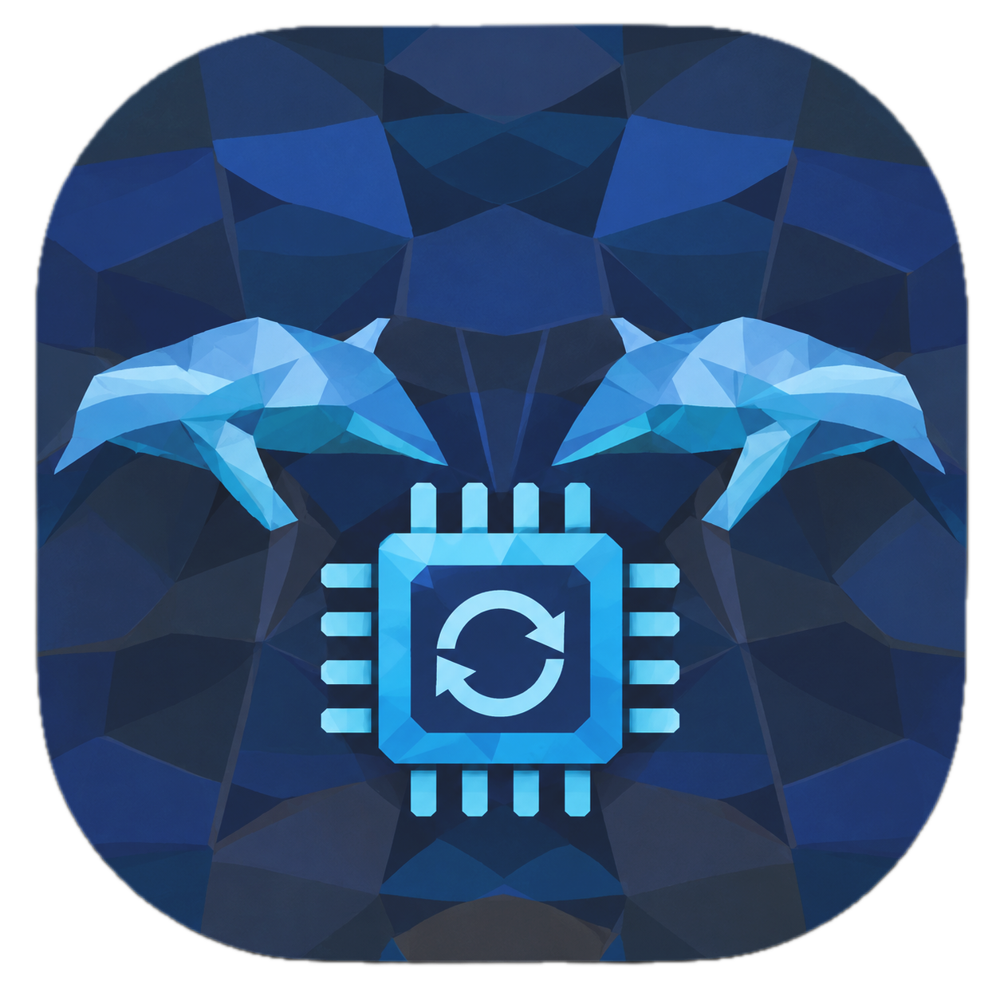

The SoundNet website provides access to software and fieldwork guides for SoundNet

<!-- TODO: The download hrefs below use the GitHub "latest release" asset pattern:
     https://github.com/Sound-Net/<repo>/releases/latest/download/<asset-file-name>
     The <asset-file-name> parts are placeholders. Replace each one with the exact
     asset name published on that repository's releases page, and the buttons will
     then download the installer directly. -->

::: {.tool-grid .column-page}

::: {.tool-card}
{.tool-icon fig-alt="SoundNet Sensor Viewer icon"}

### SoundNet Sensor Viewer

[Sound-Net/xsensViewer](https://github.com/Sound-Net/xsensViewer){.tool-repo-link}

Connect to sensor packages over USB serial, watch orientation, pressure,
temperature, light, battery and SD card state stream in live, and send commands
to the Xsens MTi-3 orientation sensor.

::: {.tool-buttons}
[Download for macOS](https://github.com/Sound-Net/xsensViewer/releases/latest/download/SoundNet.Sensor.Viewer-2.0.6.dmg){.btn .btn-primary download=""}
[Download for Windows](https://github.com/Sound-Net/xsensViewer/releases/latest/download/SoundNet.Sensor.Viewer-2.0.6.exe){.btn .btn-outline-primary download=""}
:::
:::

::: {.tool-card}
{.tool-icon fig-alt="SUDUnarchiver icon"}

### SUDUnarchiver

[Sound-Net/sudunarchiver](https://github.com/Sound-Net/sudunarchiver){.tool-repo-link}

Decompress SoundTrap `.sud` files in bulk — whole folder trees at a time, picking
exactly which data streams to extract, with multi-threading on capable machines.

::: {.tool-buttons}
[Download for macOS](https://github.com/Sound-Net/sudunarchiver/releases/latest/download/Sud.Unarchiver-1.0.3.dmg){.btn .btn-primary download=""}
[Download for Windows](https://github.com/Sound-Net/sudunarchiver/releases/download/1.0.3/Sud.Unarchiver-1.0.3.msi){.btn .btn-outline-primary download=""}
:::
:::

::: {.tool-card}
{.tool-icon fig-alt="SoundNet Sensor Firmware Updater icon"}

### Sensor Firmware Updater

[Sound-Net/sensorfirmwareupdater](https://github.com/Sound-Net/sensorfirmwareupdater){.tool-repo-link}

Install new firmware onto a sensor over USB in the field — two drop-downs and a
button, with no Arduino IDE, board packages or bootloader knowledge required.

::: {.tool-buttons}
[Download for macOS](https://github.com/Sound-Net/sensorfirmwareupdater/releases/latest/download/SoundNet.Firmware.Updater-1.0.0.dmg){.btn .btn-primary download=""}
[Download for Windows](https://github.com/Sound-Net/sensorfirmwareupdater/releases/latest/download/SoundNet.Firmware.Updater-1.0.0.exe){.btn .btn-outline-primary download=""}
:::
:::

:::

All builds come straight from each project's latest GitHub release. Older
versions and release notes are on the
[Downloads](documentation/downloads.qmd) page.
